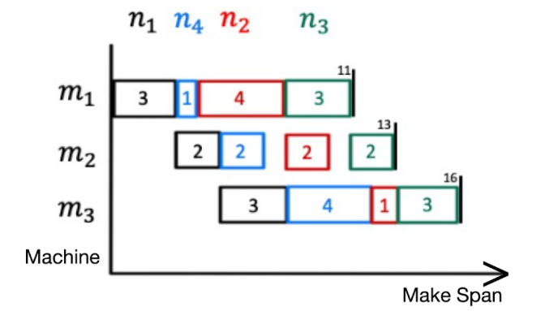

# Heuristic Algorithm

## Multi-objective Permutation Flowshop Scheduling Problem
定序流線型工廠排程問題是一種特定的流線型工廠排程問題。輸入為一組工作 $J= \{ j_1, j_2, \dots ,j_n \} $，一組機器 $M={m_1, m_2, \dots , m_n \}$及各工作在各機器作業的所需時長的表格T，如下表。輸出為一工作序列(Job order)。將每個工作安排成一順序送入機器mi中進行作業，且同一時間機器只能處理一份工作。所有工作都需要按照 $m_1, m_2, \dots, \dots , m_n$ 依序送入。目標是找到最短完工時間的工作順序。

|       | $m_1$ | $m_2$ | $m_3$ |
|-------|-------|-------|-------|
| $j_1$ |   3   |   2   |   3   |
| $j_2$ |   4   |   2   |   1   |
| $j_3$ |   3   |   2   |   3   |
| $j_4$ |   1   |   2   |   4   |


### Encoding
定序流線型工廠排程的編碼以工作編號的排序表示。如 [1, 2, 3, ..., N]，有N!種可能的工作序列。

隨機生成一工作序列(作為inital solution)
```
order = []
For i = 0..N−1 
    order[i] := i
End
For i = 0..N−1
    t = RandomInt(0, i+1)    
    Swap(order[t], order[i])
End
Return order
```
### Decoding
解碼的結果是計算出工作序列的完工時間(Makespan)
依據上表，以工作順序[1, 4, 2, 3]得到甘特圖與makespan=16


```
// decoding psuedocode
makespan = []
Foreach job In order
    time = makespan[0];
    For m = 0..MACHINE_NUM−1
        start = Max(makespan[m], time)
        time = start + DATA[job][m]               
        makespan[m] = start + DATA[job][m]
   End
End
Return makespan[MACHINE_NUM − 1]
```

## Implemented Algorithm
- 迭代法 (Iterative Improvement, II)
- 模擬退火法 (Simulated Annealing, SA)
- 禁忌搜尋法 (Tabu Search, TS)

## Result (Take minimal makespan)

| Dataset         | Makespan | Order                                                                                                                                                                                                                                                                                                      |
|-----------------|----------|------------------------------------------------------------------------------------------------------------------------------------------------------------------------------------------------------------------------------------------------------------------------------------------------------------|
| tai20_5_1.txt   | 1278     |  8 14 5   16 4 2 3 17 18 0 1 6 10 12 7 15 13 9 19 11                                                                                                                                                                                                                                                       |
| tai20_10_1.txt  | 1586     |  17 4 8 11 16 2 14 1 9 13 3 5 18 7   19 10 12 6 0 15                                                                                                                                                                                                                                                       |
| tai20_20_1.txt  | 2305     |  15 17 13 6 12 9 7 8 14 1 10 5 11   16 4 0 19 2 3 18                                                                                                                                                                                                                                                       |
| tai50_5_1.txt   | 2724     |  30 25 39 36 3 4 42 16 45 21 33 29   22 17 9 48 8 41 13 31 28 23 24 10 0 43 38 37 26 7 15 34 49 1 12 44 40 19 27   14 5 20 6 32 46 2 11 47 18 35                                                                                                                                                           |
| tai50_10_1.txt  | 3061     |  21 41 32 48 14 43 42 17 1 33 2 37   30 19 35 3 31 28 5 13 29 16 40 11 22 46 24 27 12 36 9 10 20 7 4 8 15 18 39 6   45 49 34 26 25 0 23 47 44 38                                                                                                                                                           |
| tai50_20_1.txt  | 3960     |  34 42 30 14 19 36 5 13 41 16 33 37   6 32 7 38 46 23 28 39 0 4 10 15 48 9 26 22 44 45 25 12 31 1 43 49 17 11 21 27   20 18 35 47 40 8 29 3 24 2                                                                                                                                                           |
| tai100_5_1.txt  | 5495     |  89 57 24 47 30 43 10 41 83 73 84   44 48 63 61 38 65 72 66 81 18 59 49 70 92 28 8 71 5 99 39 40 45 35 50 95 90   26 4 37 33 96 2 75 74 82 6 12 17 46 27 78 55 68 29 1 15 52 7 94 14 77 19 3 64   87 54 13 56 42 11 25 67 32 60 80 88 85 36 9 22 79 69 91 51 23 21 31 20 53 76   86 98 62 34 16 93 97 58 0 |
| tai100_10_1.txt | 5837     |  69 60 4 59 38 23 63 27 57 80 41 0   16 43 50 34 19 14 30 96 88 83 49 56 75 95 84 82 33 72 87 76 20 48 79 78 28 40   94 35 46 42 97 92 64 5 52 37 91 90 54 21 81 62 12 51 9 45 7 3 6 61 55 32 13 1   10 8 86 89 98 66 65 18 44 67 26 36 99 85 93 47 73 71 77 70 53 17 22 15 74 68   24 31 29 58 2 39 25 11 |
| tai100_20_1.txt | 6368     |  53 21 78 32 9 34 75 73 47 82 20 3   81 80 17 29 27 24 0 39 88 30 98 92 15 31 43 69 84 79 50 58 11 56 59 23 55 61   5 40 2 85 52 54 64 93 90 60 99 44 19 46 77 74 45 72 10 8 4 26 1 70 38 36 57   66 91 41 65 95 83 62 22 42 25 28 87 63 16 76 97 35 14 13 18 94 71 33 86 7 37   67 51 96 49 48 68 89 12 6 |
